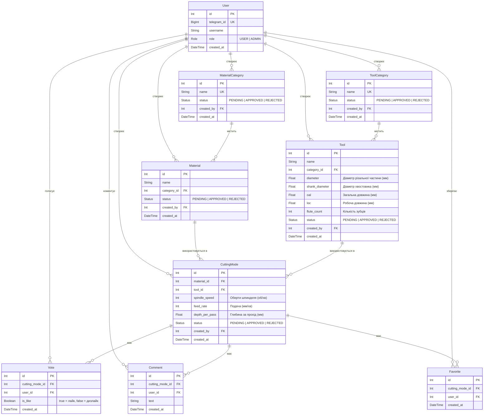
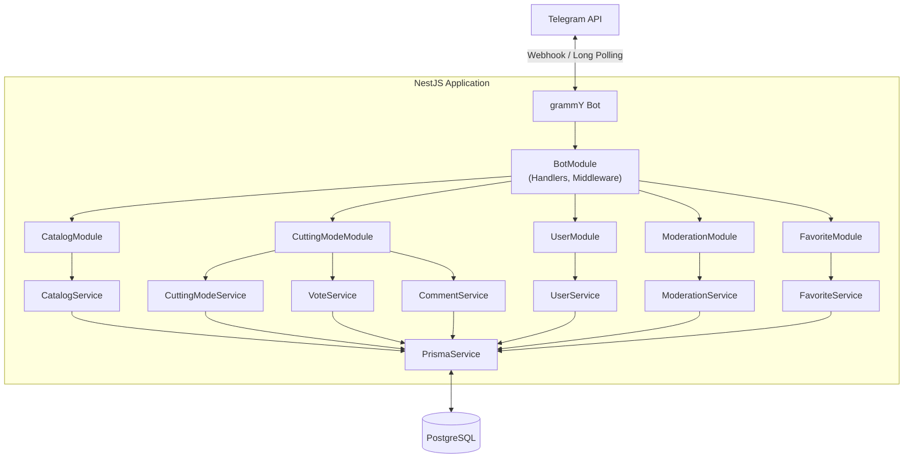
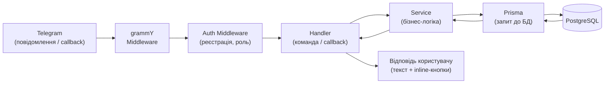
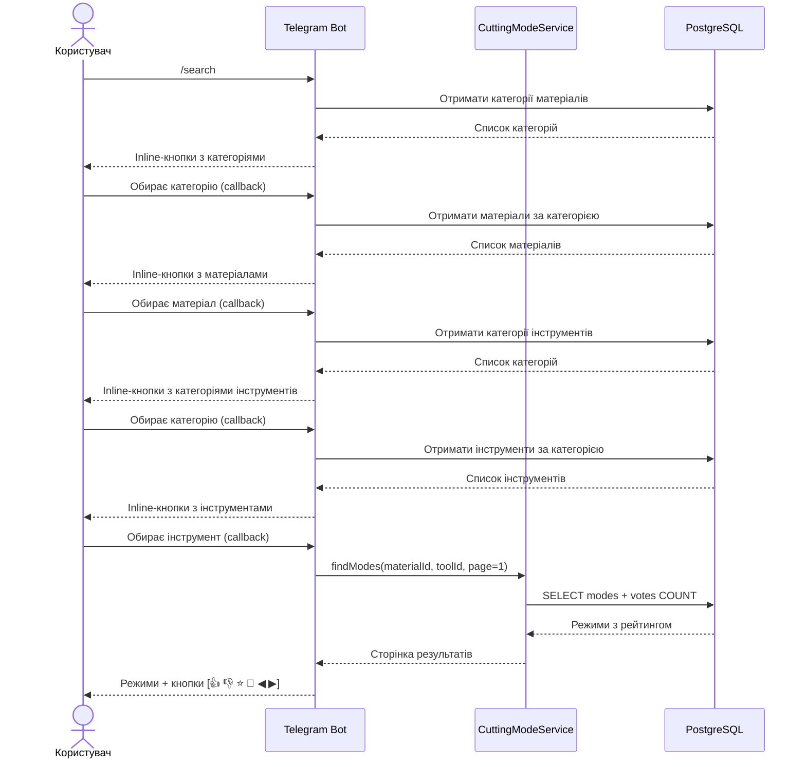
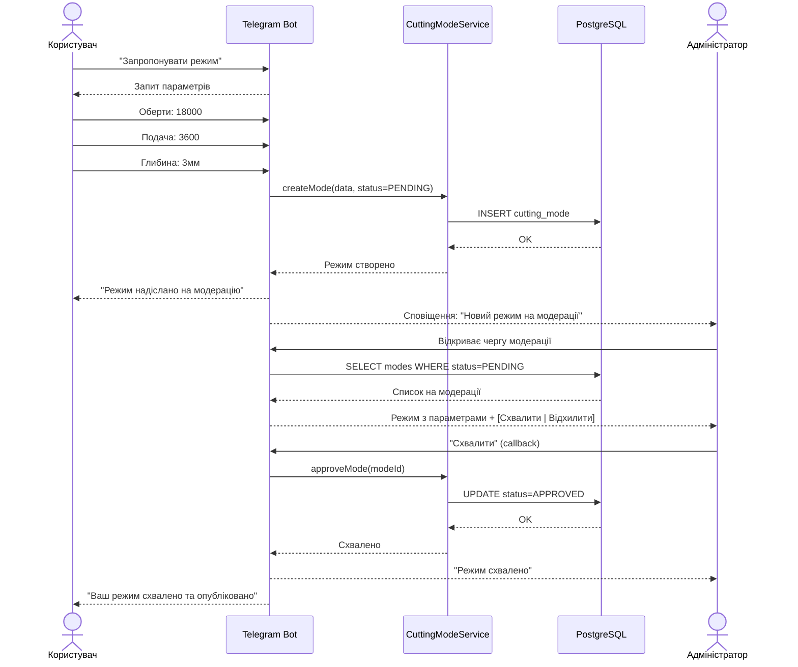
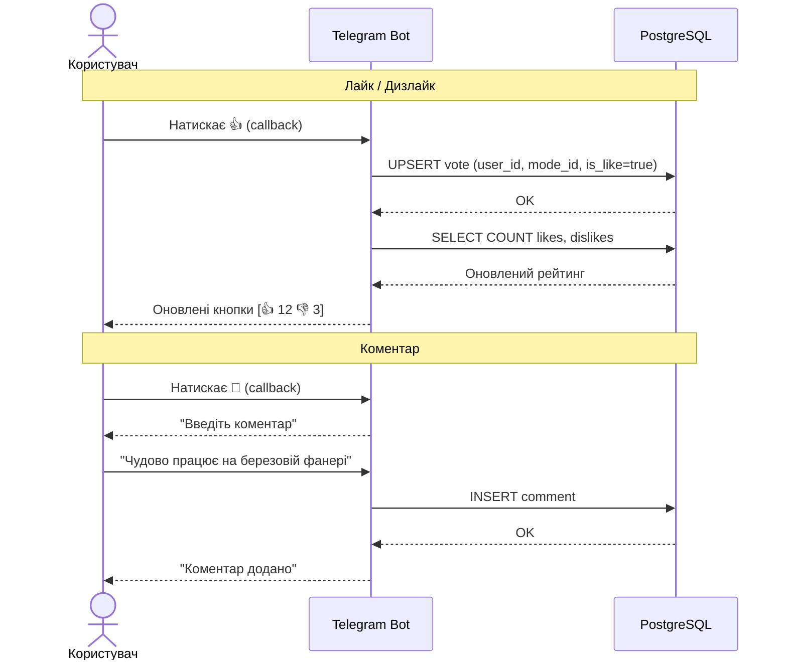

# CNC Helper — Telegram-бот довідник режимів фрезерування

Telegram-бот, який допомагає операторам ЧПК-верстатів підібрати оптимальні режими різання для конкретного матеріалу та інструменту. Користувачі можуть шукати режими, оцінювати їх, залишати коментарі та пропонувати власні.

## Стек технологій

| Технологія | Призначення |
|------------|-------------|
| **TypeScript** | Основна мова розробки |
| **NestJS** | Серверний фреймворк (модульна архітектура, DI) |
| **grammY** | Бібліотека для роботи з Telegram Bot API |
| **Prisma** | ORM для роботи з базою даних, міграції, генерація типів |
| **PostgreSQL** | Реляційна база даних |

## Основні можливості

- Пошук режимів різання за зв'язкою **матеріал + інструмент**
- Каталог матеріалів та інструментів з категоріями
- Рейтингова система (лайк/дизлайк) для режимів
- Коментарі до режимів
- Обране — збереження корисних режимів
- Користувацький контент з модерацією
- Пагінація результатів

## Ролі

| Роль | Можливості |
|------|------------|
| **Користувач** | Перегляд каталогу та режимів, лайк/дизлайк, коментарі, обране, пропозиція режимів/матеріалів/інструментів (з модерацією) |
| **Адміністратор** | Все те саме + модерація пропозицій, пряме додавання до каталогу без модерації |

## Авторизація

Ідентифікація користувача за Telegram ID. Окрема реєстрація не потрібна.

## Параметри режиму різання

| Параметр | Приклад |
|----------|---------|
| Оберти шпинделя (RPM) | 18 000 об/хв |
| Подача (Feed Rate) | 3 600 мм/хв |
| Глибина за прохід | 3 мм |

## Структура каталогу

**Матеріали** розділені за категоріями:
- Плити → Фанера, МДФ, ДСП...
- Метали → Алюміній, Бронза, Латунь...
- ...

**Інструменти** класифікуються за категоріями:
- Пазові фрези
- Радіусні фрези
- Конічні фрези
- ...

### Параметри інструменту

| Параметр | Опис | Приклад |
|----------|------|---------|
| Діаметр різальної частини (D) | Діаметр робочої зони фрези | 4 мм |
| Діаметр хвостовика | Частина, що затискається в цангу шпинделя | 6 мм |
| Загальна довжина (OAL) | Повна довжина фрези від кінчика до кінця хвостовика | 50 мм |
| Робоча довжина (LOC) | Довжина різальної частини з канавками | 22 мм |
| Кількість зубців (заходів) | Число різальних кромок (1, 2, 3+) | 2 |

## Схема бази даних (ERD)



### Опис сутностей

| Сутність | Опис |
|----------|------|
| **User** | Користувач бота, ідентифікується за Telegram ID |
| **MaterialCategory** | Категорія матеріалів (Плити, Метали тощо) |
| **Material** | Конкретний матеріал (Фанера, Алюміній тощо) |
| **ToolCategory** | Категорія інструментів (Пазові, Радіусні тощо) |
| **Tool** | Конкретний інструмент з параметрами |
| **CuttingMode** | Режим різання — зв'язка матеріал + інструмент + параметри |
| **Vote** | Лайк або дизлайк на режим (унікальний: один голос на користувач + режим) |
| **Comment** | Текстовий коментар до режиму |
| **Favorite** | Збережений режим в обраному (унікальний: один на користувач + режим) |

### Статуси модерації

```
PENDING → APPROVED   (адміністратор схвалив)
PENDING → REJECTED   (адміністратор відхилив)
```

Контент, доданий адміністратором, одразу отримує статус `APPROVED`.

## Архітектура системи

### Загальна схема



### Модулі NestJS

| Модуль | Відповідальність |
|--------|-----------------|
| **BotModule** | Ініціалізація grammY, обробка команд та callback-кнопок, middleware (авторизація, визначення ролі) |
| **UserModule** | Реєстрація за Telegram ID, управління ролями |
| **CatalogModule** | CRUD для матеріалів, інструментів та їх категорій |
| **CuttingModeModule** | Пошук режимів, створення, голосування, коментарі |
| **FavoriteModule** | Додавання / видалення / перегляд обраного |
| **ModerationModule** | Черга модерації, схвалення / відхилення, сповіщення |
| **PrismaModule** | Підключення до БД, глобальний сервіс Prisma |

### Структура проєкту

```
src/
├── app.module.ts
├── main.ts
├── bot/
│   ├── bot.module.ts
│   ├── bot.service.ts              # Ініціалізація grammY
│   ├── handlers/
│   │   ├── start.handler.ts        # /start
│   │   ├── search.handler.ts       # Пошук режимів
│   │   ├── catalog.handler.ts      # Перегляд каталогів
│   │   ├── suggest.handler.ts      # Пропозиція контенту
│   │   ├── favorite.handler.ts     # Обране
│   │   ├── my-modes.handler.ts     # Мої режими
│   │   └── moderation.handler.ts   # Модерація (адмін)
│   ├── keyboards/
│   │   └── inline.keyboards.ts     # Inline-кнопки
│   └── middleware/
│       └── auth.middleware.ts       # Реєстрація + роль користувача
├── user/
│   ├── user.module.ts
│   └── user.service.ts
├── catalog/
│   ├── catalog.module.ts
│   └── catalog.service.ts
├── cutting-mode/
│   ├── cutting-mode.module.ts
│   ├── cutting-mode.service.ts
│   ├── vote.service.ts
│   └── comment.service.ts
├── favorite/
│   ├── favorite.module.ts
│   └── favorite.service.ts
├── moderation/
│   ├── moderation.module.ts
│   └── moderation.service.ts
└── prisma/
    ├── prisma.module.ts
    └── prisma.service.ts

prisma/
├── schema.prisma
└── migrations/
```

### Потік обробки запиту



## UML-діаграми

### Use Case діаграма

```mermaid
graph TB
    subgraph "CNC Helper Bot"

        subgraph "Каталог"
            UC1["UC-1: Перегляд каталогу матеріалів"]
            UC2["UC-2: Перегляд каталогу інструментів"]
            UC3["UC-3: Пошук режимів різання"]
        end

        subgraph "Взаємодія з режимами"
            UC4["UC-4: Оцінка режиму"]
            UC5["UC-5: Коментування режиму"]
            UC6["UC-6: Додавання в обране"]
            UC7["UC-7: Перегляд обраного"]
        end

        subgraph "Користувацький контент"
            UC8["UC-8: Пропозиція режиму"]
            UC9["UC-9: Редагування режиму"]
            UC10["UC-10: Видалення режиму"]
            UC11["UC-11: Пропозиція матеріалу"]
            UC12["UC-12: Пропозиція інструменту"]
            UC13["UC-13: Пропозиція категорії"]
        end

        subgraph "Адміністрування"
            UC14["UC-14: Модерація режимів"]
            UC15["UC-15: Модерація каталогу"]
            UC16["UC-16: Пряме додавання до каталогу"]
            UC17["UC-17: Пряме додавання режиму"]
        end
    end

    User(("Користувач"))
    Admin(("Адміністратор"))

    User --> UC1
    User --> UC2
    User --> UC3
    User --> UC4
    User --> UC5
    User --> UC6
    User --> UC7
    User --> UC8
    User --> UC9
    User --> UC10
    User --> UC11
    User --> UC12
    User --> UC13

    Admin --> UC1
    Admin --> UC2
    Admin --> UC3
    Admin --> UC4
    Admin --> UC5
    Admin --> UC6
    Admin --> UC7
    Admin --> UC14
    Admin --> UC15
    Admin --> UC16
    Admin --> UC17

    UC3 -.->|"include"| UC1
    UC3 -.->|"include"| UC2
    UC4 -.->|"extend"| UC3
    UC5 -.->|"extend"| UC3
    UC6 -.->|"extend"| UC3
```



### Sequence діаграма: Пошук режимів різання (UC-3)



### Sequence діаграма: Пропозиція режиму з модерацією (UC-8 → UC-14)



### Sequence діаграма: Оцінка та коментування (UC-4, UC-5)



## Use Cases

### UC-1: Перегляд каталогу матеріалів

**Актор:** Користувач

| Крок | Дія |
|------|-----|
| 1 | Користувач відкриває каталог матеріалів |
| 2 | Бот відображає список категорій матеріалів (Плити, Метали тощо) |
| 3 | Користувач обирає категорію |
| 4 | Бот відображає список матеріалів у обраній категорії |

---

### UC-2: Перегляд каталогу інструментів

**Актор:** Користувач

| Крок | Дія |
|------|-----|
| 1 | Користувач відкриває каталог інструментів |
| 2 | Бот відображає список категорій інструментів (Пазові, Радіусні тощо) |
| 3 | Користувач обирає категорію |
| 4 | Бот відображає список інструментів у категорії (з діаметрами) |

---

### UC-3: Пошук режимів різання

**Актор:** Користувач

| Крок | Дія |
|------|-----|
| 1 | Користувач обирає категорію матеріалу |
| 2 | Користувач обирає конкретний матеріал |
| 3 | Користувач обирає категорію інструменту |
| 4 | Користувач обирає конкретний інструмент |
| 5 | Бот відображає список режимів з рейтингом (посторінково) |

---

### UC-4: Оцінка режиму (лайк/дизлайк)

**Актор:** Користувач

**Передумова:** Користувач переглядає режим (UC-3)

| Крок | Дія |
|------|-----|
| 1 | Користувач натискає "лайк" або "дизлайк" на режимі |
| 2 | Бот оновлює рейтинг та підтверджує дію |

**Альтернативний потік:** Якщо користувач вже голосував — голос змінюється або знімається.

---

### UC-5: Коментування режиму

**Актор:** Користувач

**Передумова:** Користувач переглядає режим (UC-3)

| Крок | Дія |
|------|-----|
| 1 | Користувач обирає "залишити коментар" |
| 2 | Користувач вводить текст коментаря |
| 3 | Бот публікує коментар (без модерації) |

---

### UC-6: Додавання режиму в обране

**Актор:** Користувач

**Передумова:** Користувач переглядає режим (UC-3)

| Крок | Дія |
|------|-----|
| 1 | Користувач натискає "В обране" |
| 2 | Бот зберігає режим в обране користувача |

---

### UC-7: Перегляд обраного

**Актор:** Користувач

| Крок | Дія |
|------|-----|
| 1 | Користувач відкриває розділ "Обране" |
| 2 | Бот відображає збережені режими (посторінково) |
| 3 | Користувач може перейти до будь-якого збереженого режиму |

---

### UC-8: Пропозиція нового режиму

**Актор:** Користувач

| Крок | Дія |
|------|-----|
| 1 | Користувач обирає матеріал та інструмент |
| 2 | Користувач натискає "Запропонувати режим" |
| 3 | Користувач вводить параметри (оберти, подача, глибина) |
| 4 | Бот надсилає режим на модерацію та сповіщує користувача |

**Постумова:** Режим з'являється у черзі модерації адміністратора.

---

### UC-9: Редагування свого режиму (до схвалення)

**Актор:** Користувач

**Передумова:** Режим ще не схвалений адміністратором.

| Крок | Дія |
|------|-----|
| 1 | Користувач відкриває список своїх запропонованих режимів |
| 2 | Користувач обирає режим зі статусом "На модерації" |
| 3 | Користувач змінює параметри |
| 4 | Бот зберігає зміни |

---

### UC-10: Видалення свого режиму

**Актор:** Користувач

| Крок | Дія |
|------|-----|
| 1 | Користувач відкриває список своїх режимів |
| 2 | Користувач натискає "Видалити" на обраному режимі |
| 3 | Бот запитує підтвердження |
| 4 | Користувач підтверджує видалення |
| 5 | Бот видаляє режим |

**Примітка:** Доступно для режимів у будь-якому статусі (на модерації / схвалений).

---

### UC-11: Пропозиція нового матеріалу

**Актор:** Користувач

| Крок | Дія |
|------|-----|
| 1 | Користувач обирає "Запропонувати матеріал" |
| 2 | Користувач вводить назву матеріалу |
| 3 | Користувач обирає існуючу категорію |
| 4 | Бот надсилає пропозицію на модерацію |

---

### UC-12: Пропозиція нового інструменту

**Актор:** Користувач

| Крок | Дія |
|------|-----|
| 1 | Користувач обирає "Запропонувати інструмент" |
| 2 | Користувач вводить параметри інструменту (діаметр, хвостовик, OAL, LOC, кількість зубців) |
| 3 | Користувач обирає існуючу категорію |
| 4 | Бот надсилає пропозицію на модерацію |

---

### UC-13: Пропозиція нової категорії

**Актор:** Користувач

| Крок | Дія |
|------|-----|
| 1 | Користувач обирає "Запропонувати категорію" |
| 2 | Користувач вказує тип (матеріали або інструменти) |
| 3 | Користувач вводить назву категорії |
| 4 | Бот надсилає пропозицію на модерацію |

---

### UC-14: Модерація режимів

**Актор:** Адміністратор

| Крок | Дія |
|------|-----|
| 1 | Адміністратор відкриває чергу модерації |
| 2 | Бот відображає запропоновані режими з параметрами |
| 3 | Адміністратор обирає режим |
| 4 | Адміністратор натискає "Схвалити" або "Відхилити" |
| 5 | Бот оновлює статус та сповіщує автора |

---

### UC-15: Модерація матеріалів, інструментів та категорій

**Актор:** Адміністратор

| Крок | Дія |
|------|-----|
| 1 | Адміністратор відкриває чергу модерації каталогу |
| 2 | Бот відображає запропоновані елементи (матеріали/інструменти/категорії) |
| 3 | Адміністратор схвалює або відхиляє пропозицію |
| 4 | Бот оновлює каталог (при схваленні) та сповіщує автора |

---

### UC-16: Пряме додавання до каталогу (адмін)

**Актор:** Адміністратор

| Крок | Дія |
|------|-----|
| 1 | Адміністратор обирає "Додати" (матеріал / інструмент / категорію) |
| 2 | Адміністратор вводить дані |
| 3 | Бот додає елемент до каталогу без модерації |

---

### UC-17: Пряме додавання режиму (адмін)

**Актор:** Адміністратор

| Крок | Дія |
|------|-----|
| 1 | Адміністратор обирає матеріал та інструмент |
| 2 | Адміністратор вводить параметри режиму |
| 3 | Бот публікує режим без модерації |
