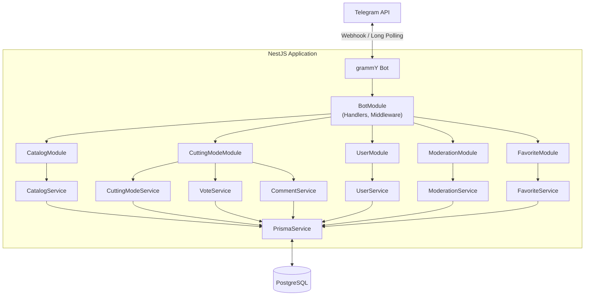
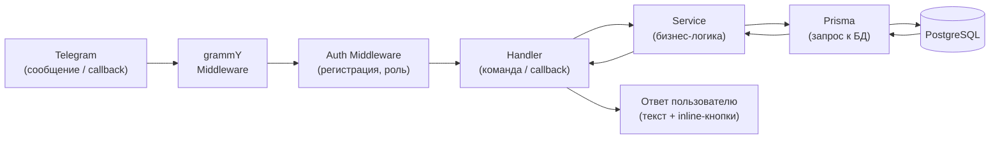
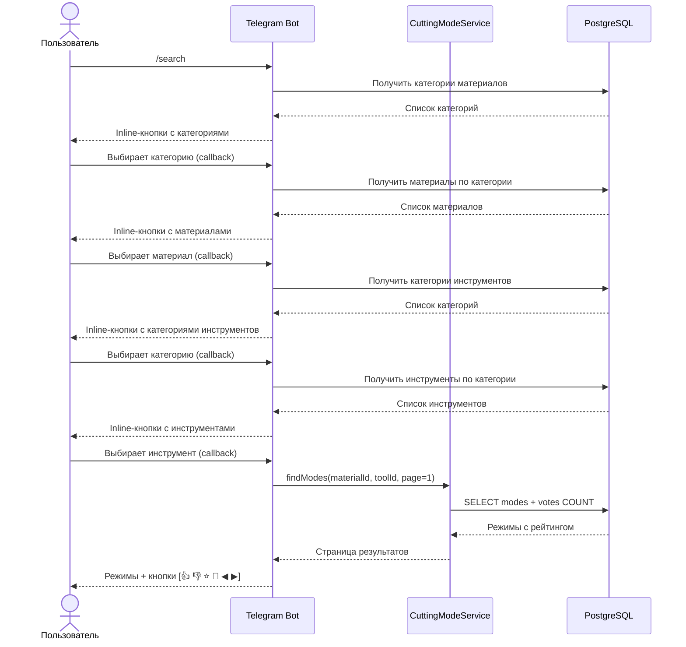
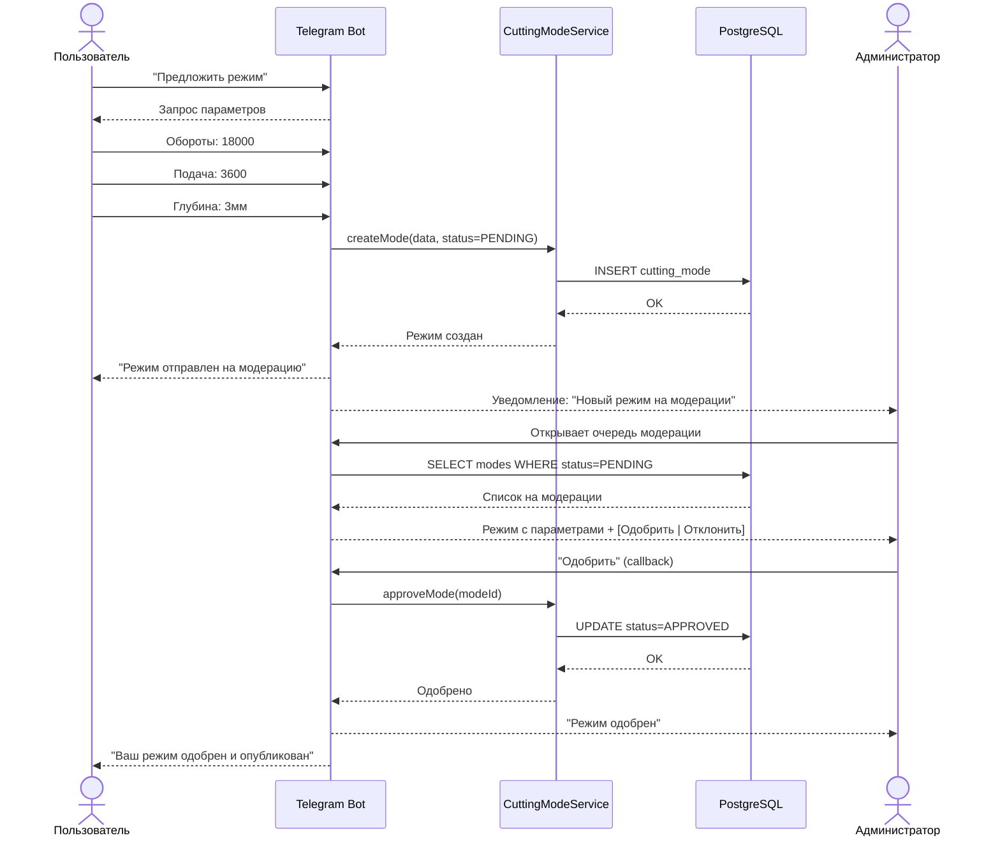
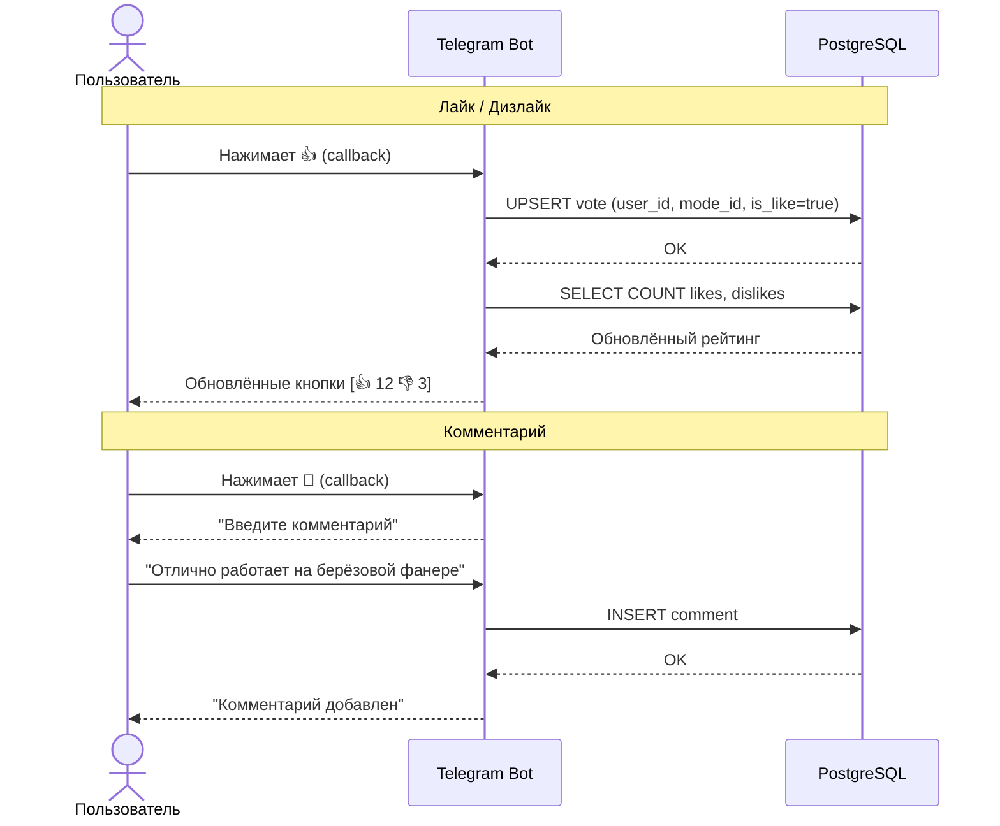

# CNC Helper — Telegram-бот справочник режимов фрезерования

Telegram-бот, который помогает операторам ЧПУ-станков подобрать оптимальные режимы резки для конкретного материала и инструмента. Пользователи могут искать режимы, оценивать их, оставлять комментарии и предлагать собственные.

## Стек технологий

| Технология | Назначение |
|------------|------------|
| **TypeScript** | Основной язык разработки |
| **NestJS** | Серверный фреймворк (модульная архитектура, DI) |
| **grammY** | Библиотека для работы с Telegram Bot API |
| **Prisma** | ORM для работы с базой данных, миграции, генерация типов |
| **PostgreSQL** | Реляционная база данных |

## Основные возможности

- Поиск режимов резки по связке **материал + инструмент**
- Каталог материалов и инструментов с категориями
- Рейтинговая система (лайк/дизлайк) для режимов
- Комментарии к режимам
- Избранное — сохранение полезных режимов
- Пользовательский контент с модерацией
- Пагинация результатов

## Роли

| Роль | Возможности |
|------|-------------|
| **Пользователь** | Просмотр каталога и режимов, лайк/дизлайк, комментарии, избранное, предложение режимов/материалов/инструментов (с модерацией) |
| **Администратор** | Всё то же + модерация предложений, прямое добавление в каталог без модерации |

## Авторизация

Идентификация пользователя по Telegram ID. Отдельная регистрация не требуется.

## Параметры режима резки

| Параметр | Пример |
|----------|--------|
| Обороты шпинделя (RPM) | 18 000 об/мин |
| Подача (Feed Rate) | 3 600 мм/мин |
| Глубина за проход | 3 мм |

## Структура каталога

**Материалы** разделены по категориям:
- Плиты → Фанера, МДФ, ДСП...
- Металлы → Алюминий, Бронза, Латунь...
- ...

**Инструменты** классифицируются по категориям:
- Пазовые фрезы
- Радиусные фрезы
- Конические фрезы
- ...

### Параметры инструмента

| Параметр | Описание | Пример |
|----------|----------|--------|
| Диаметр режущей части (D) | Диаметр рабочей зоны фрезы | 4 мм |
| Диаметр хвостовика | Часть, зажимаемая в цангу шпинделя | 6 мм |
| Общая длина (OAL) | Полная длина фрезы от кончика до конца хвостовика | 50 мм |
| Рабочая длина (LOC) | Длина режущей части с канавками | 22 мм |
| Количество зубьев (заходов) | Число режущих кромок (1, 2, 3+) | 2 |

## Схема базы данных (ERD)

```mermaid
erDiagram
    User {
        Int id PK
        BigInt telegram_id UK
        String username
        Role role "USER | ADMIN"
        DateTime created_at
    }

    MaterialCategory {
        Int id PK
        String name UK
        Status status "PENDING | APPROVED | REJECTED"
        Int created_by FK
        DateTime created_at
    }

    Material {
        Int id PK
        String name
        Int category_id FK
        Status status "PENDING | APPROVED | REJECTED"
        Int created_by FK
        DateTime created_at
    }

    ToolCategory {
        Int id PK
        String name UK
        Status status "PENDING | APPROVED | REJECTED"
        Int created_by FK
        DateTime created_at
    }

    Tool {
        Int id PK
        String name
        Int category_id FK
        Float diameter "Диаметр режущей части (мм)"
        Float shank_diameter "Диаметр хвостовика (мм)"
        Float oal "Общая длина (мм)"
        Float loc "Рабочая длина (мм)"
        Int flute_count "Количество зубьев"
        Status status "PENDING | APPROVED | REJECTED"
        Int created_by FK
        DateTime created_at
    }

    CuttingMode {
        Int id PK
        Int material_id FK
        Int tool_id FK
        Int spindle_speed "Обороты шпинделя (об/мин)"
        Int feed_rate "Подача (мм/мин)"
        Float depth_per_pass "Глубина за проход (мм)"
        Status status "PENDING | APPROVED | REJECTED"
        Int created_by FK
        DateTime created_at
    }

    Vote {
        Int id PK
        Int cutting_mode_id FK
        Int user_id FK
        Boolean is_like "true = лайк, false = дизлайк"
        DateTime created_at
    }

    Comment {
        Int id PK
        Int cutting_mode_id FK
        Int user_id FK
        String text
        DateTime created_at
    }

    Favorite {
        Int id PK
        Int cutting_mode_id FK
        Int user_id FK
        DateTime created_at
    }

    User ||--o{ MaterialCategory : "создаёт"
    User ||--o{ Material : "создаёт"
    User ||--o{ ToolCategory : "создаёт"
    User ||--o{ Tool : "создаёт"
    User ||--o{ CuttingMode : "создаёт"
    User ||--o{ Vote : "голосует"
    User ||--o{ Comment : "комментирует"
    User ||--o{ Favorite : "сохраняет"

    MaterialCategory ||--o{ Material : "содержит"
    ToolCategory ||--o{ Tool : "содержит"

    Material ||--o{ CuttingMode : "используется в"
    Tool ||--o{ CuttingMode : "используется в"

    CuttingMode ||--o{ Vote : "имеет"
    CuttingMode ||--o{ Comment : "имеет"
    CuttingMode ||--o{ Favorite : "имеет"
```



### Описание сущностей

| Сущность | Описание |
|----------|----------|
| **User** | Пользователь бота, идентифицируется по Telegram ID |
| **MaterialCategory** | Категория материалов (Плиты, Металлы и т.д.) |
| **Material** | Конкретный материал (Фанера, Алюминий и т.д.) |
| **ToolCategory** | Категория инструментов (Пазовые, Радиусные и т.д.) |
| **Tool** | Конкретный инструмент с параметрами |
| **CuttingMode** | Режим резки — связка материал + инструмент + параметры |
| **Vote** | Лайк или дизлайк на режим (уникален: один голос на пользователь + режим) |
| **Comment** | Текстовый комментарий к режиму |
| **Favorite** | Сохранённый режим в избранном (уникален: один на пользователь + режим) |

### Статусы модерации

```
PENDING → APPROVED   (администратор одобрил)
PENDING → REJECTED   (администратор отклонил)
```

Контент, добавленный администратором, сразу получает статус `APPROVED`.

## Архитектура системы

### Общая схема



### Модули NestJS

| Модуль | Ответственность |
|--------|----------------|
| **BotModule** | Инициализация grammY, обработка команд и callback-кнопок, middleware (авторизация, определение роли) |
| **UserModule** | Регистрация по Telegram ID, управление ролями |
| **CatalogModule** | CRUD для материалов, инструментов и их категорий |
| **CuttingModeModule** | Поиск режимов, создание, голосование, комментарии |
| **FavoriteModule** | Добавление / удаление / просмотр избранного |
| **ModerationModule** | Очередь модерации, одобрение / отклонение, уведомления |
| **PrismaModule** | Подключение к БД, глобальный сервис Prisma |

### Структура проекта

```
src/
├── app.module.ts
├── main.ts
├── bot/
│   ├── bot.module.ts
│   ├── bot.service.ts              # Инициализация grammY
│   ├── handlers/
│   │   ├── start.handler.ts        # /start
│   │   ├── search.handler.ts       # Поиск режимов
│   │   ├── catalog.handler.ts      # Просмотр каталогов
│   │   ├── suggest.handler.ts      # Предложение контента
│   │   ├── favorite.handler.ts     # Избранное
│   │   ├── my-modes.handler.ts     # Мои режимы
│   │   └── moderation.handler.ts   # Модерация (админ)
│   ├── keyboards/
│   │   └── inline.keyboards.ts     # Inline-кнопки
│   └── middleware/
│       └── auth.middleware.ts       # Регистрация + роль пользователя
├── user/
│   ├── user.module.ts
│   └── user.service.ts
├── catalog/
│   ├── catalog.module.ts
│   └── catalog.service.ts
├── cutting-mode/
│   ├── cutting-mode.module.ts
│   ├── cutting-mode.service.ts
│   ├── vote.service.ts
│   └── comment.service.ts
├── favorite/
│   ├── favorite.module.ts
│   └── favorite.service.ts
├── moderation/
│   ├── moderation.module.ts
│   └── moderation.service.ts
└── prisma/
    ├── prisma.module.ts
    └── prisma.service.ts

prisma/
├── schema.prisma
└── migrations/
```

### Поток обработки запроса



## UML-диаграммы

### Use Case диаграмма

```mermaid
graph TB
    subgraph "CNC Helper Bot"

        subgraph "Каталог"
            UC1["UC-1: Просмотр каталога материалов"]
            UC2["UC-2: Просмотр каталога инструментов"]
            UC3["UC-3: Поиск режимов резки"]
        end

        subgraph "Взаимодействие с режимами"
            UC4["UC-4: Оценка режима"]
            UC5["UC-5: Комментирование режима"]
            UC6["UC-6: Добавление в избранное"]
            UC7["UC-7: Просмотр избранного"]
        end

        subgraph "Пользовательский контент"
            UC8["UC-8: Предложение режима"]
            UC9["UC-9: Редактирование режима"]
            UC10["UC-10: Удаление режима"]
            UC11["UC-11: Предложение материала"]
            UC12["UC-12: Предложение инструмента"]
            UC13["UC-13: Предложение категории"]
        end

        subgraph "Администрирование"
            UC14["UC-14: Модерация режимов"]
            UC15["UC-15: Модерация каталога"]
            UC16["UC-16: Прямое добавление в каталог"]
            UC17["UC-17: Прямое добавление режима"]
        end
    end

    User(("👤 Пользователь"))
    Admin(("🔧 Администратор"))

    User --> UC1
    User --> UC2
    User --> UC3
    User --> UC4
    User --> UC5
    User --> UC6
    User --> UC7
    User --> UC8
    User --> UC9
    User --> UC10
    User --> UC11
    User --> UC12
    User --> UC13

    Admin --> UC1
    Admin --> UC2
    Admin --> UC3
    Admin --> UC4
    Admin --> UC5
    Admin --> UC6
    Admin --> UC7
    Admin --> UC14
    Admin --> UC15
    Admin --> UC16
    Admin --> UC17

    UC3 -.->|"include"| UC1
    UC3 -.->|"include"| UC2
    UC4 -.->|"extend"| UC3
    UC5 -.->|"extend"| UC3
    UC6 -.->|"extend"| UC3
```



### Sequence диаграмма: Поиск режимов резки (UC-3)



### Sequence диаграмма: Предложение режима с модерацией (UC-8 → UC-14)



### Sequence диаграмма: Оценка и комментирование (UC-4, UC-5)



## Use Cases

### UC-1: Просмотр каталога материалов

**Актор:** Пользователь

| Шаг | Действие |
|-----|----------|
| 1 | Пользователь открывает каталог материалов |
| 2 | Бот отображает список категорий материалов (Плиты, Металлы и т.д.) |
| 3 | Пользователь выбирает категорию |
| 4 | Бот отображает список материалов в выбранной категории |

---

### UC-2: Просмотр каталога инструментов

**Актор:** Пользователь

| Шаг | Действие |
|-----|----------|
| 1 | Пользователь открывает каталог инструментов |
| 2 | Бот отображает список категорий инструментов (Пазовые, Радиусные и т.д.) |
| 3 | Пользователь выбирает категорию |
| 4 | Бот отображает список инструментов в категории (с диаметрами) |

---

### UC-3: Поиск режимов резки

**Актор:** Пользователь

| Шаг | Действие |
|-----|----------|
| 1 | Пользователь выбирает категорию материала |
| 2 | Пользователь выбирает конкретный материал |
| 3 | Пользователь выбирает категорию инструмента |
| 4 | Пользователь выбирает конкретный инструмент |
| 5 | Бот отображает список режимов с рейтингом (постранично) |

---

### UC-4: Оценка режима (лайк/дизлайк)

**Актор:** Пользователь

**Предусловие:** Пользователь просматривает режим (UC-3)

| Шаг | Действие |
|-----|----------|
| 1 | Пользователь нажимает "лайк" или "дизлайк" на режиме |
| 2 | Бот обновляет рейтинг и подтверждает действие |

**Альтернативный поток:** Если пользователь уже голосовал — голос меняется или снимается.

---

### UC-5: Комментирование режима

**Актор:** Пользователь

**Предусловие:** Пользователь просматривает режим (UC-3)

| Шаг | Действие |
|-----|----------|
| 1 | Пользователь выбирает "оставить комментарий" |
| 2 | Пользователь вводит текст комментария |
| 3 | Бот публикует комментарий (без модерации) |

---

### UC-6: Добавление режима в избранное

**Актор:** Пользователь

**Предусловие:** Пользователь просматривает режим (UC-3)

| Шаг | Действие |
|-----|----------|
| 1 | Пользователь нажимает "В избранное" |
| 2 | Бот сохраняет режим в избранное пользователя |

---

### UC-7: Просмотр избранного

**Актор:** Пользователь

| Шаг | Действие |
|-----|----------|
| 1 | Пользователь открывает раздел "Избранное" |
| 2 | Бот отображает сохранённые режимы (постранично) |
| 3 | Пользователь может перейти к любому сохранённому режиму |

---

### UC-8: Предложение нового режима

**Актор:** Пользователь

| Шаг | Действие |
|-----|----------|
| 1 | Пользователь выбирает материал и инструмент |
| 2 | Пользователь нажимает "Предложить режим" |
| 3 | Пользователь вводит параметры (обороты, подача, глубина) |
| 4 | Бот отправляет режим на модерацию и уведомляет пользователя |

**Постусловие:** Режим появляется в очереди модерации у администратора.

---

### UC-9: Редактирование своего режима (до одобрения)

**Актор:** Пользователь

**Предусловие:** Режим ещё не одобрен администратором.

| Шаг | Действие |
|-----|----------|
| 1 | Пользователь открывает список своих предложенных режимов |
| 2 | Пользователь выбирает режим со статусом "На модерации" |
| 3 | Пользователь изменяет параметры |
| 4 | Бот сохраняет изменения |

---

### UC-10: Удаление своего режима

**Актор:** Пользователь

| Шаг | Действие |
|-----|----------|
| 1 | Пользователь открывает список своих режимов |
| 2 | Пользователь нажимает "Удалить" на выбранном режиме |
| 3 | Бот запрашивает подтверждение |
| 4 | Пользователь подтверждает удаление |
| 5 | Бот удаляет режим |

**Примечание:** Доступно для режимов в любом статусе (на модерации / одобрен).

---

### UC-11: Предложение нового материала

**Актор:** Пользователь

| Шаг | Действие |
|-----|----------|
| 1 | Пользователь выбирает "Предложить материал" |
| 2 | Пользователь вводит название материала |
| 3 | Пользователь выбирает существующую категорию |
| 4 | Бот отправляет предложение на модерацию |

---

### UC-12: Предложение нового инструмента

**Актор:** Пользователь

| Шаг | Действие |
|-----|----------|
| 1 | Пользователь выбирает "Предложить инструмент" |
| 2 | Пользователь вводит параметры инструмента (диаметр, хвостовик, OAL, LOC, кол-во зубьев, материал) |
| 3 | Пользователь выбирает существующую категорию |
| 4 | Бот отправляет предложение на модерацию |

---

### UC-13: Предложение новой категории

**Актор:** Пользователь

| Шаг | Действие |
|-----|----------|
| 1 | Пользователь выбирает "Предложить категорию" |
| 2 | Пользователь указывает тип (материалы или инструменты) |
| 3 | Пользователь вводит название категории |
| 4 | Бот отправляет предложение на модерацию |

---

### UC-14: Модерация режимов

**Актор:** Администратор

| Шаг | Действие |
|-----|----------|
| 1 | Администратор открывает очередь модерации |
| 2 | Бот отображает предложенные режимы с параметрами |
| 3 | Администратор выбирает режим |
| 4 | Администратор нажимает "Одобрить" или "Отклонить" |
| 5 | Бот обновляет статус и уведомляет автора |

---

### UC-15: Модерация материалов, инструментов и категорий

**Актор:** Администратор

| Шаг | Действие |
|-----|----------|
| 1 | Администратор открывает очередь модерации каталога |
| 2 | Бот отображает предложенные элементы (материалы/инструменты/категории) |
| 3 | Администратор одобряет или отклоняет предложение |
| 4 | Бот обновляет каталог (при одобрении) и уведомляет автора |

---

### UC-16: Прямое добавление в каталог (админ)

**Актор:** Администратор

| Шаг | Действие |
|-----|----------|
| 1 | Администратор выбирает "Добавить" (материал / инструмент / категорию) |
| 2 | Администратор вводит данные |
| 3 | Бот добавляет элемент в каталог без модерации |

---

### UC-17: Прямое добавление режима (админ)

**Актор:** Администратор

| Шаг | Действие |
|-----|----------|
| 1 | Администратор выбирает материал и инструмент |
| 2 | Администратор вводит параметры режима |
| 3 | Бот публикует режим без модерации |
